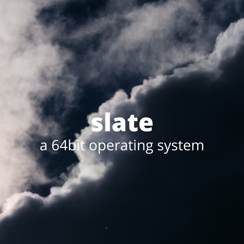

### Features
- Long mode
- Memory Management
- VESA

### Planned Features
These are in order of implementation.
- LAPIC
- SMP
- Syscalls
- PCI
- Disk
    - AHCI
    - VFS
    - EXT2/4
- Binary and ELF loading
- Userspace

### Building and Running

Prerequisites:
- nasm
- make
- mkfs
- x86_64-elf-gcc (and all its prerequisites)

```
sudo make all FSTYPE="ext2" -j6
```

### Contributing

Refer to CODETYLE.md to find the preferred codestyle for this project (TODO)
    
